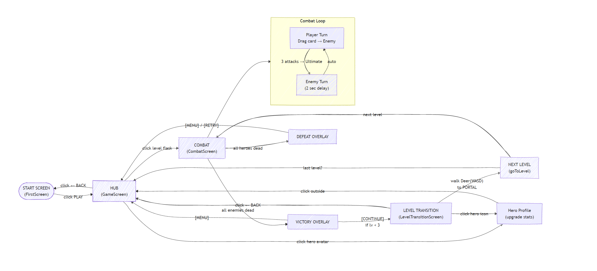
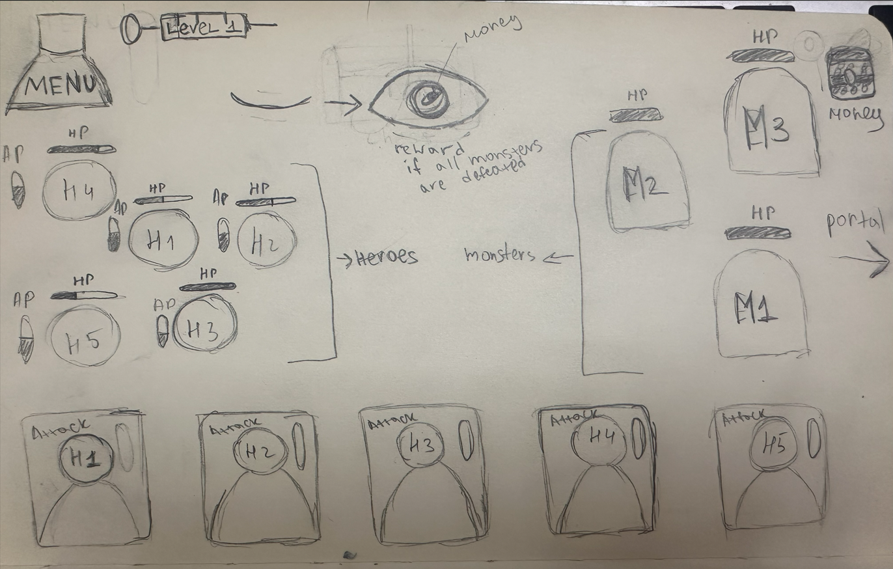

## PHASE 1

Game Concept End of Experiment is a 2D pixel-art RPG where the player progresses through a 3-level campaign.
The core mechanic involves selecting character-specific ability cards from 4 slots to defeat enemies in turn-based combat. 
After 3 attacks, a hero's Ultimate card becomes available. 
Pills earned from battles are used to upgrade heroes' stats (up to level 3). 
The player wins when all enemies are defeated, and loses if the party's HP drops to zero. After victory, a reward chest overlay appears. Built for desktop using libGDX.

# Team Roles

Project Lead — Kudaibergen Nazerke.
Lead Programmer — Kudaibergen Nazerke.
Programmer — Tolegenova Moldir.
Designer / Artist — Tolegenova Moldir.
-Our Tools GitHub, Trello, LibGDX.-

## PHASE 2

--Game Design Document (GDD) — End of Experiment--

Game Summary End of Experiment is a 2D pixel-art RPG with 3 unique heroes (Sakura, Gojo, Yuki). 
The gameplay has two phases: Hub (upgrade heroes, select levels) and Combat (turn-based card battles with 4 card slots). 
After combat, a Level Transition phase lets the player walk to a portal to enter the next level. 
Each hero can be upgraded up to level 3.

# Controls

WASD / Arrow Keys — Move the Deer during Level Transition.
Mouse Left-Click — Play cards on enemies, click hero profiles to upgrade, click level flasks to start combat.
Mouse Hover — View card descriptions, hero stats, enemy HP.
ESC — Pause (not implemented).
Characters (Party)

3 Heroes: Sakura (Rabbit) — AOE acid bomb + heal ultimate; Gojo (Horse) — single target + taunt & shield ultimate; Yuki (Deer) — single target + double damage ultimate.
Each hero has: HP, Damage, Ultimate Damage, and can be upgraded to level 3 (costs 50/120 pills).
Currency: Pills, earned from level rewards (150/360/1000).
Enemies

Pig, Rat, Croco — each with their own HP and attack values. They attack in a fixed order: Deer → Rabbit → Horse.
Enemies have a 2-second delay between attacks.
Levels

Structure: 3 levels (max level = 3 in code).
Flow: Hub → Select Level → Combat → Victory/Defeat overlay → Level Transition (walk to portal) → Next Level or Hub.
Win / Lose Screen

Victory Overlay: Shows "VICTORY!" with collected pills, "MENU" and "CONTINUE" buttons. On level 3, Continue is disabled (last level).
Defeat Overlay: Shows "DEFEAT" with "MENU" and "RETRY" buttons.
Pills are awarded immediately on victory.
Art Style

2D pixel art. 3 hero sprites (Rabbit, Horse, Deer), 3 enemy types (Pig, Rat, Croco). UI includes HP bars and shield indicators. Card slots display hero attack animations.

# Game Flow Diagram

# Class Diagram

# Level Sketch 

